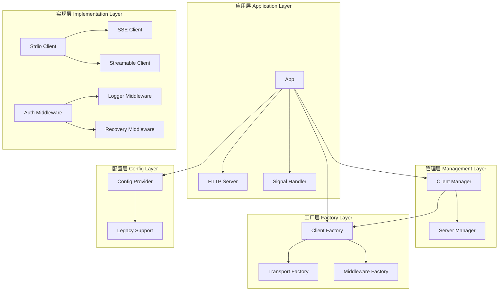

# MCP Proxy Server - 重构版本

基于 github.com/mark3labs/mcp-go 库的模块化 MCP 代理服务器，采用现代化的架构设计，支持多种传输协议和灵活的扩展。

## 🎯 重构亮点

### 核心改进
- **模块化架构**：采用分层架构 + 依赖注入 + 策略模式
- **高度解耦**：模块间通过接口通信，易于测试和扩展
- **工厂模式**：支持动态创建不同类型的客户端和传输层
- **中间件系统**：可插拔的中间件支持认证、日志、错误恢复等
- **并发安全**：全面使用互斥锁保护共享资源
- **优雅关闭**：支持信号处理和资源清理

## 📁 项目结构

```
mcp-proxy/
├── cmd/                           # 命令行入口
│   └── main.go
├── internal/
│   ├── app/                       # 应用层 - 协调各模块
│   │   └── app.go
│   ├── interfaces/                # 接口定义层
│   │   └── interfaces.go
│   ├── config/                    # 配置模块
│   │   ├── provider.go
│   │   └── legacy.go
│   ├── client/                    # 客户端层
│   │   ├── factory.go             # 客户端工厂
│   │   ├── manager.go             # 客户端管理器
│   │   ├── stdio.go               # Stdio 客户端实现
│   │   ├── sse.go                 # SSE 客户端实现
│   │   └── streamable.go          # Streamable HTTP 客户端实现
│   ├── middleware/                # 中间件层
│   │   ├── auth/
│   │   ├── logger/
│   │   └── recovery/
│   └── server/                    # 服务器层
│       ├── manager.go             # 服务器管理器
│       └── proxy.go               # 代理服务器实现
├── pkg/                           # 公共包
├── configs/                       # 配置文件示例
│   └── example.json
└── README_REFACTORED.md
```

## 🏗️ 架构设计

### 分层架构图



### 核心接口设计

```go
// 主要接口
type MCPClient interface {
    Connect(ctx context.Context, clientInfo mcp.Implementation) error
    Disconnect() error
    GetName() string
    GetType() string
    IsConnected() bool
    // ... MCP 协议方法
}

type ClientFactory interface {
    CreateClient(name string, config ClientConfig) (MCPClient, error)
    SupportedTypes() []string
}

type Middleware interface {
    Handle(next http.Handler) http.Handler
    GetName() string
}
```

## 🚀 特性

### 传输协议支持
- **Stdio**：通过标准输入输出与子进程通信
- **SSE**：Server-Sent Events 实时通信
- **Streamable HTTP**：基于 HTTP 的流式通信

### 中间件支持
- **认证中间件**：基于 Bearer Token 的身份验证
- **日志中间件**：请求日志记录
- **恢复中间件**：Panic 恢复和错误处理

### 高级功能
- **工具过滤**：支持 allow/block 模式的工具过滤
- **配置继承**：客户端配置可继承代理默认配置
- **并发启动**：客户端并发初始化提高启动速度
- **优雅关闭**：支持信号处理和资源清理

## 📋 配置示例

```json
{
  "mcpProxy": {
    "baseURL": "https://mcp.example.com",
    "addr": ":9090",
    "name": "MCP Proxy",
    "version": "2.0.0",
    "type": "sse",
    "options": {
      "panicIfInvalid": false,
      "logEnabled": true,
      "authTokens": ["default-token-123"]
    }
  },
  "mcpServers": {
    "github": {
      "transportType": "stdio",
      "command": "npx",
      "args": ["-y", "@modelcontextprotocol/server-github"],
      "env": {
        "GITHUB_PERSONAL_ACCESS_TOKEN": "<YOUR_TOKEN>"
      },
      "options": {
        "toolFilter": {
          "mode": "block",
          "list": ["create_or_update_file"]
        }
      }
    },
    "weather": {
      "transportType": "sse",
      "url": "https://weather.mcp.example.com/sse",
      "headers": {
        "Authorization": "Bearer weather-api-token"
      }
    }
  }
}
```

## 🔧 使用方法

### 编译
```bash
go build -o mcp-proxy ./cmd
```

### 运行
```bash
./mcp-proxy --config configs/example.json
```

### 命令行参数
```bash
Usage of mcp-proxy:
  -config string
        path to config file or a http(s) url (default "config.json")
  -help
        print help and exit
  -version
        print version and exit
```

## 🔌 扩展开发

### 添加新的客户端类型

1. 实现 `MCPClient` 接口：
```go
type MyClient struct {
    // 字段定义
}

func (c *MyClient) Connect(ctx context.Context, clientInfo mcp.Implementation) error {
    // 连接实现
}
// ... 其他方法
```

2. 在工厂中注册：
```go
func (f *Factory) CreateClient(name string, config interfaces.ClientConfig) (interfaces.MCPClient, error) {
    switch config.TransportType {
    case "my-transport":
        return NewMyClient(name, config)
    // ... 其他类型
    }
}
```

### 添加新的中间件

1. 实现 `Middleware` 接口：
```go
type MyMiddleware struct {
    config MyConfig
}

func (m *MyMiddleware) Handle(next http.Handler) http.Handler {
    return http.HandlerFunc(func(w http.ResponseWriter, r *http.Request) {
        // 中间件逻辑
        next.ServeHTTP(w, r)
    })
}

func (m *MyMiddleware) GetName() string {
    return "my-middleware"
}
```

2. 在应用层中使用：
```go
middlewares = append(middlewares, mypackage.New(config))
```

## 🧪 测试

### 单元测试
```bash
go test ./internal/...
```

### 集成测试
```bash
go test -tags=integration ./...
```

## 📊 性能优化

- **并发客户端启动**：使用 errgroup 并发初始化客户端
- **连接池管理**：支持连接复用和管理
- **内存优化**：及时释放资源，避免内存泄漏
- **错误恢复**：Panic 恢复机制保证服务稳定性

## 🔄 兼容性

- **向后兼容**：自动适配旧版本配置格式
- **渐进式迁移**：支持逐步迁移到新架构
- **API 稳定性**：核心接口保持稳定

## 🛠️ 开发指南

### 代码规范
- 遵循 Go 语言惯例
- 使用接口实现依赖注入
- 每个包职责单一
- 完善的错误处理

### 提交规范
- feat: 新功能
- fix: 错误修复
- refactor: 代码重构
- docs: 文档更新

## 📝 许可证

MIT License - 详见 [LICENSE](LICENSE) 文件

## 🙏 致谢

- [mark3labs/mcp-go](https://github.com/mark3labs/mcp-go) - 底层 MCP 协议实现
- 原始项目的所有贡献者
